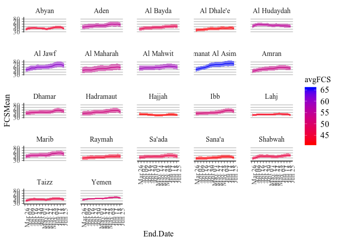
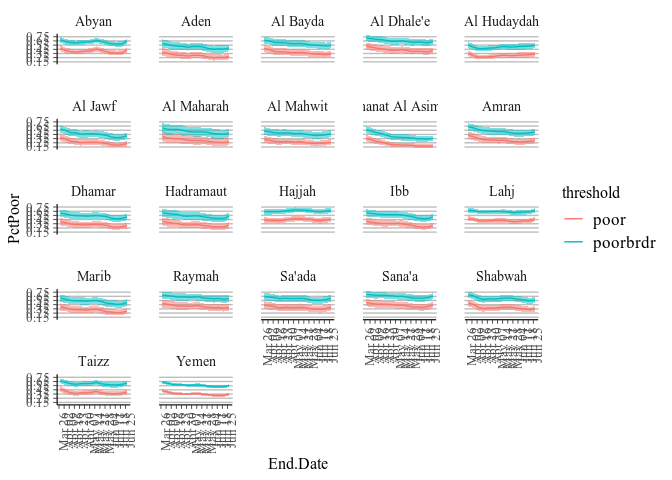
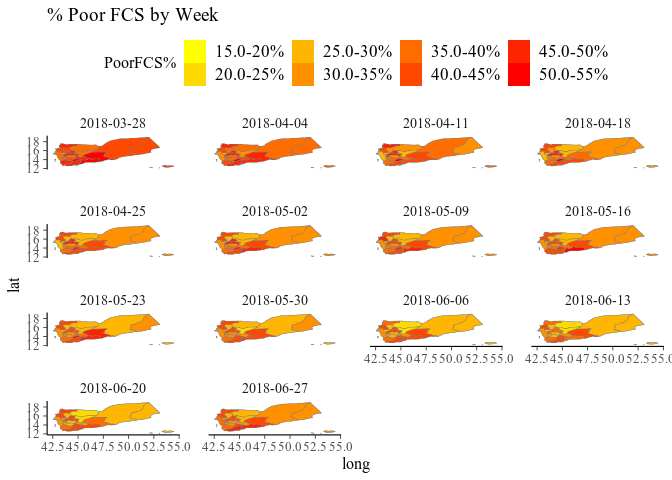
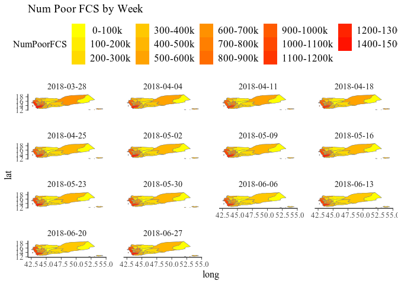
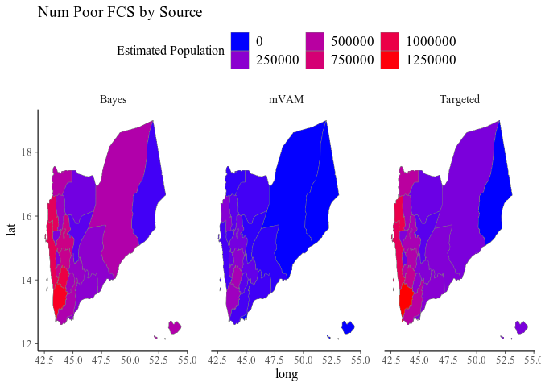
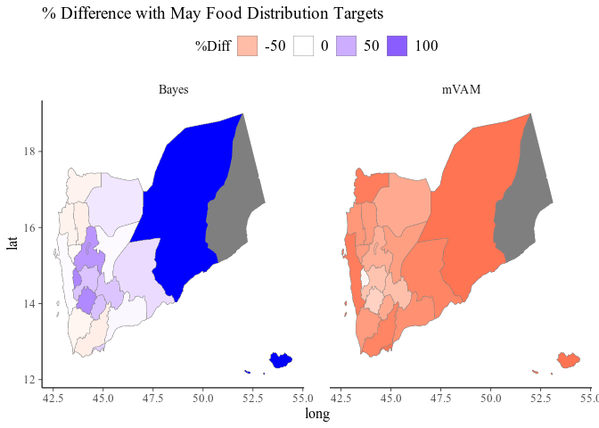

Intro - Data Prep
-----------------

In this notebook we use the Bayesian Suquential Survey Estimator on an mVAM dataset collected in Yemen starting in March of 2018. We use three datasets:

1.  mVAM data - collected daily over the phone with key demographic variables and the Food Consumption Score indicator

2.  Baseline data (F2F)- Emergency Food Security and Nutrition Assessment (EFSNA) data collected face-to-face in Yemen during ceasefire in fall of 2016. Also contains key demographic variables and the Food Consumption Score indicator

3.  Demographic and Health Survey (DHS) data - 2013 survey of over 17000 households in Yemen collecting key demographic and health indicators. does not have Food Consumption Score, but we use it solely for the purpose of posterior simulation, predicting FCS from the demographic variables, which are presumably as representative as can be without a census

We also use an additional dataset of population by governorate to convert prevalence estimates to absolute values.

``` r
##################
### Data Prep  ###
##################
library(xlsx)
library(survey)
library(plyr)

#mvam Suvey- data we will use to update baseline model
ymnRspDF <- data.table::fread('ymnData/mVAMYmnObs.csv',sep=';',na.strings='')

#DHS Survey - demographic data to use for posterior simulation
dhsDF <- data.table::fread('ymnData/DHS2013.csv',sep=';',na.strings='')
dhsDF <- as.data.frame(dhsDF)

#EFSNA face-t0-face survey - data to fit baseline model (this dataset is confidential and cannot be shared)
efsnaDF <- data.table::fread('ymnData/ymnEFSNA2016.csv',sep=';',na.strings='')

#Population Data
ymnPopDF <- read.xlsx('C:/Users/gaurav.singhal/Desktop/ymnSeqMdl/cso_2017_population_projection_sexage_disagreggated.xlsx',
                      sheetIndex=1)

#Create table for IPC Phase
svyYmn <- svydesign(ids=~Cluster_No+ID,
                    strata=~ADM1_NAME+NULL,
                    weights=~weight,
                    pps='brewer',
                    data=efsnaDF,
                    nest=TRUE)

ymn.FCG.2016 <- prop.table(svytable(~ADM1_NAME+FCS_Cat,svyYmn),1)
colnames(ymn.FCG.2016) <- c('2016.Severe','2016.Moderate','2016.OK')
ymn.FCG.2016 <- rbind(ymn.FCG.2016,ymn.FCG.2016[c("Hajjah","Hadramaut"),])
rownames(ymn.FCG.2016)[dim(ymn.FCG.2016)[1]-1] <- "Sa'ada"
rownames(ymn.FCG.2016)[dim(ymn.FCG.2016)[1]] <- "Al Maharah"
ymn.FCG.2016 <- as.data.frame(ymn.FCG.2016)

#Assign IPC phase to governorates
ymn.FCG.2016$IPCclass <- 'Emergency'
stressed <- c('Hadramaut','Al Maharah')
ymn.FCG.2016$IPCclass[rownames(ymn.FCG.2016) %in% stressed] <- 'Stressed'
crisis <- c('Al Jawf','Marib','Amran','Amanat Al Asimah','Al Mahwit','Al Hudaydah','Dhamar','Raymah','Ibb')
ymn.FCG.2016$IPCclass[rownames(ymn.FCG.2016) %in% crisis] <- 'Crisis'
ymn.FCG.2016$ADM1_NAME <- rownames(ymn.FCG.2016)
rm(svyYmn,stressed,crisis)

#Filter mVAM dataset for latest questionnaire and Merge
colsmVAM <- c('ObsID','RspID','SvyID','SelectWt','CmbAdjWt','ADM1_NAME','ADM2_NAME',
              'rCSI','FCS','FCG','FoodInsecure','isUrban','isIDP',
              'HHSizeGrp','HoHSex_is_F','HoHEdu','H2OSrc','FuelSrc','HH_has_Elctrc','Toilet_is_Flush')

mvamDF <- as.data.frame(ymnRspDF[ymnRspDF$SvyID>=181,])
mvamDF <- mvamDF[,colSums(is.na(mvamDF))<0.9*nrow(mvamDF)]
mvamDF <- mvamDF[complete.cases(mvamDF[,colsmVAM]),]
mvamDF <- mvamDF[,append(colsmVAM,setdiff(colnames(mvamDF),colsmVAM))]
mvamDF <- merge(mvamDF,ymn.FCG.2016,all.x=TRUE,by='ADM1_NAME')
mvamDF$FreeResponse <- NULL
mvamDF$FreeResponseEng <- NULL

#Filter DHS dataset for complete.cases and merge
colsDHS <- c('HHID','ADM1_NAME','wgt','HHS_Class','HHS_Score','isUrban',
             'HHSizeGrp','HoHSex_is_F','HoHEdu','H2OSrc','FuelSrc','HH_has_Elctrc','Toilet_is_Flush')
dmgDF <- as.data.frame(dhsDF)
dmgDF <- dmgDF[complete.cases(dmgDF[,colsDHS]),]
dmgDF <- dmgDF[,append(colsDHS,setdiff(colnames(dhsDF),colsDHS))]
dmgDF <- merge(dmgDF,ymn.FCG.2016,all.x=TRUE,by='ADM1_NAME')

#Filter EFSNA df for complete.cases and merge
colsEFSNA <- c('ID','ADM1_NAME','wgt','isUrban','FCS','isIDP',
               'HHSizeGrp','HoHSex_is_F','HoHEdu','H2OSrc','FuelSrc','HH_has_Elctrc','Toilet_is_Flush')
efsnaDF <- as.data.frame(efsnaDF)
baseDF <- efsnaDF[complete.cases(efsnaDF[,colsEFSNA]),]
baseDF <- baseDF[,colsEFSNA]
baseDF <- merge(baseDF,ymn.FCG.2016,all.x=TRUE,by='ADM1_NAME')
baseDF$FCS[baseDF$FCS<12] <- 12
baseDF$logFCS.2016 <- log(baseDF$FCS)

#add rows for Sa'ada and Al Maharah as they are missing the original baseline data
extDF <- baseDF[baseDF$ADM1_NAME %in% c('Hajjah','Hadramaut'),]
extDF$ADM1_NAME <- revalue(extDF$ADM1_NAME,c('Hajjah'="Sa'ada",'Hadramaut'='Al Maharah'))
baseDF <- rbind(baseDF,extDF)
baseDF$ADM1_NAME <- as.character(baseDF$ADM1_NAME)
rm(extDF)

print('Data Loaded!')
```

#### baseline dataset

    ##   ADM1_NAME   ID   wgt isUrban  FCS isIDP HHSizeGrp HoHSex_is_F    HoHEdu
    ## 1     Abyan    1 1.036    TRUE 18.0 FALSE     (5,8]        TRUE    noEduc
    ## 2     Abyan    2 1.038   FALSE 20.5 FALSE  (16,100]       FALSE   primary
    ## 3     Abyan  732 0.942   FALSE 22.5 FALSE     (5,8]        TRUE    noEduc
    ## 4     Abyan 3528 0.930   FALSE 21.0 FALSE     (5,8]       FALSE    noEduc
    ## 5     Abyan 1464 1.038    TRUE 22.0 FALSE    (8,12]       FALSE    higher
    ## 6     Abyan 3409 0.942   FALSE 42.0 FALSE     (5,8]       FALSE secondary
    ##       H2OSrc FuelSrc HH_has_Elctrc Toilet_is_Flush 2016.Severe
    ## 1      piped    wood         FALSE           FALSE   0.1305556
    ## 2 protectSrc    wood         FALSE            TRUE   0.1305556
    ## 3 protectSrc     gas         FALSE            TRUE   0.1305556
    ## 4  tankTruck    wood         FALSE            TRUE   0.1305556
    ## 5 protectSrc     gas         FALSE            TRUE   0.1305556
    ## 6 protectSrc    wood         FALSE            TRUE   0.1305556
    ##   2016.Moderate   2016.OK  IPCclass logFCS.2016
    ## 1     0.3527778 0.5166667 Emergency    2.890372
    ## 2     0.3527778 0.5166667 Emergency    3.020425
    ## 3     0.3527778 0.5166667 Emergency    3.113515
    ## 4     0.3527778 0.5166667 Emergency    3.044522
    ## 5     0.3527778 0.5166667 Emergency    3.091042
    ## 6     0.3527778 0.5166667 Emergency    3.737670

#### mVAM dataset

    ##   ADM1_NAME isUrban FCS isIDP HHSizeGrp HoHSex_is_F    HoHEdu H2OSrc
    ## 1     Abyan   FALSE  57 FALSE     (5,8]       FALSE secondary  piped
    ## 2     Abyan   FALSE  77 FALSE    (8,12]       FALSE secondary  piped
    ## 3     Abyan   FALSE  94 FALSE     (5,8]       FALSE secondary  piped
    ## 4     Abyan   FALSE  93 FALSE    (8,12]       FALSE secondary  piped
    ## 5     Abyan   FALSE  63 FALSE     (2,5]       FALSE    higher  other
    ## 6     Abyan   FALSE  48 FALSE     (5,8]       FALSE secondary  piped
    ##   FuelSrc HH_has_Elctrc Toilet_is_Flush 2016.Severe 2016.Moderate
    ## 1     gas          TRUE            TRUE   0.1305556     0.3527778
    ## 2     gas          TRUE            TRUE   0.1305556     0.3527778
    ## 3     gas          TRUE            TRUE   0.1305556     0.3527778
    ## 4     gas          TRUE            TRUE   0.1305556     0.3527778
    ## 5     gas          TRUE            TRUE   0.1305556     0.3527778
    ## 6     gas          TRUE            TRUE   0.1305556     0.3527778
    ##     2016.OK  IPCclass  SelectWt    ObsDate SvyID
    ## 1 0.5166667 Emergency 0.3333333 2018-05-12   183
    ## 2 0.5166667 Emergency 0.5000000 2018-05-10   183
    ## 3 0.5166667 Emergency 0.3333333 2018-06-11   184
    ## 4 0.5166667 Emergency 0.5000000 2018-04-16   182
    ## 5 0.5166667 Emergency 0.5000000 2018-05-08   183
    ## 6 0.5166667 Emergency 0.3333333 2018-04-01   182

#### DHS dataset

    ##   ADM1_NAME   wgt isUrban HHSizeGrp HoHSex_is_F  HoHEdu H2OSrc FuelSrc
    ## 1       Ibb 1.026    TRUE    (8,12]       FALSE primary  piped     gas
    ## 2       Ibb 1.026    TRUE     (2,5]       FALSE primary  piped     gas
    ## 3       Ibb 1.026    TRUE     (5,8]       FALSE  higher  piped     gas
    ## 4       Ibb 1.026    TRUE     (5,8]        TRUE  noEduc  piped     gas
    ## 5       Ibb 1.026    TRUE     (5,8]       FALSE  noEduc  piped     gas
    ## 6       Ibb 1.026    TRUE     (2,5]       FALSE  noEduc  piped     gas
    ##   HH_has_Elctrc Toilet_is_Flush
    ## 1          TRUE            TRUE
    ## 2          TRUE            TRUE
    ## 3          TRUE            TRUE
    ## 4          TRUE            TRUE
    ## 5          TRUE            TRUE
    ## 6          TRUE            TRUE

Construct initial baseline model
--------------------------------

Next we construct a multi-level random effect model on the baseline F2F data, that predicts log(FCS) on the host of available demographic and socioeconomic information. Effectively the models are dividing the population into a myriad of *cells* demograpahically decohering the log(FCS) estimates such that we are estimating the marginal distributions of log(FCS) by demographic covariate. Those covariates that are not independent of each other (such as IPC phase and governorate) are appropriately nested such that the nested variable is conditionally independent on the other). The joint probabilities of the marginal distributions yield the individual demographic-cell value, allowing sparse cells (those with few observations) to *borrow strength* from neighboring cells.

First we use lme4 to fit a non-Bayesian model based on maximizing the Random-Effects Maximum Likelihood criterion. Those estimates are then set as priors to the same model but estimated using rstanarm's Markov Chain Monte Carlo estimator. The results should largely be the same, but the latter model can be Bayes' updated with new information.

``` r
#####################################
### Create initial baseline model ###
#####################################
library(lme4)
library(rstanarm)

#create model formula
base.fmla <- as.formula(log(FCS) ~ HoHSex_is_F+HH_has_Elctrc+Toilet_is_Flush+isUrban+
                   (1|HHSizeGrp)+(1|HoHEdu)+(1|H2OSrc)+(1|FuelSrc)+(1|IPCclass/ADM1_NAME))

#(A) fit REML model using lme4 on the baseline data
base.mdl <- lmer(base.fmla,data=baseDF,weights=wgt)

#(B) fit Bayiesn model using lme model values as priors. We inflate the estimated variance to give the MCMC sampler more 'search room'
base.mdl.stan <- stan_lmer(base.fmla,data=baseDF,weights=wgt,
                           iter=3000,chains=4,cores=4,thin=2,control=list(adapt_delta=.965),QR=TRUE,
                           prior_intercept = normal(offset.mdl@beta[1],sqrt(vcov(base.mdl)[1,1])*10))
rm(base.mdl)
```

Construct mode-effect model
---------------------------

The above model allows us to correct for differences in demographics with our mVAM surveys, as we are using the mVAM information to solely estimate the mean and variances of the demographic marginal distributions with respect to log(FCS). However, as mVAM uses a different modality--phone vs face-to-face--there exists a second form bias whereby respondents' estimates change due to survey mode. We eliminate this bias with the assumption that is is fixed (not dependent on time) and dependent on the respondents' socio-demographic profile as well. Therefore we take an mVAM dataset from the same time period, use the above model to predict FCS (out-of-sample) using the socio-demographic variables in the mVAM dataset, and compute its' errors vis-a-vis the reported mVAM FCS. Those errors are then the respondents' theorized estimate of 'mode-effect.' We regress the same hierarchical random-effects model on the errors to then predict 'mode-effect' on new respondents. Ergo, when new mVAM data arrives. We first run the mode-effect correction model to adjust the respondents' corresponding log(FCS) for mode-bias. As the mode-effect itself is a random variable, we must use the bootstrap technique to compute subsequent variances.

``` r
#########################################
### Create mode-effect (offset) model ###
#########################################
##(2) fit offset model to correct for mode effect using the residuals of the baseline model simulated on mVAM data

#(A) massage mvam data first because Sa'ada and Al Maharah governorates missing from baseline survey
###  we assume Sa'ada=Hajjah and Al Maharah="Hadramaut for this purpose
mvamDF$ADM1_NAME <- as.factor(mvamDF$ADM1_NAME)
mvamDF$ADM1_NAME_ACTUAL <- mvamDF$ADM1_NAME
mvamDF$ADM1_NAME <- droplevels(revalue(mvamDF$ADM1_NAME,c("Sa'ada"="Hajjah","Al Maharah"="Hadramaut")))

#(B) now perform posterior simulations (i.e. predictions) of the previous baseline model on the new mVAM data
mvamDF$logFCS.prior <- rowMeans(t(posterior_predict(base.mdl.stan,newdata=mvamDF[,c(colsmVAM,'IPCclass')],
                                                    draws=500)))

#(C) now as know actual reported log(FCS) from the mVAM data, compute differences vis-a-vis the above predictions mvamDF$logFCS.diff <- with(mvamDF,log(FCS)-logFCS.prior)

#(D) revert governorates
mvamDF$ADM1_NAME <- mvamDF$ADM1_NAME_ACTUAL
mvamDF$ADM1_NAME_ACTUAL <- NULL

### Model Formula
offset.fmla <- as.formula(logFCS.diff ~ HoHSex_is_F+HH_has_Elctrc+Toilet_is_Flush+isUrban+
                     (1|HHSizeGrp)+(1|HoHEdu)+(1|H2OSrc)+(1|FuelSrc)+(1|IPCclass/ADM1_NAME))

#NOTE: SvyID==181 is a filter as to use only 1 round of information corresponding to mVAM's closest available time period to when the F2F survey was completed

#(E) first fit lme model as prior for rstanarm model 
offset.mdl <- lmer(offset.fmla,data=mvamDF[mvamDF$SvyID==181,],weights=SelectWt)

#(F) fit rstanarm with lme prior
offset.mdl.stan <- stan_lmer(offset.fmla,weights=SelectWt,
                             iter=3000,chains=4,cores=4,thin=2,control=list(adapt_delta=.965),QR=TRUE,
                             prior_intercept = normal(offset.mdl@beta[1],sqrt(vcov(offset.mdl)[1,1])*10))
rm(offset.mdl)
```

Perform Bayesian Sequential Update on models with new data
----------------------------------------------------------

With these two models in place we can now perform Bayesian sequential updates as new mVAM data arrives upon the baseline model that predicts log(FCS) as a function of socio-demographic variables. This is done as a batch process using a rolling window over the data of a specified time length (usually 30 days). The model for the new moving window is computed by performing a Bayesian sequential update, that is using the previous parameter estimates as a prior for the new parameter estimates, on the previous window's model using only the data from the current moving window. This is repeated for the whole sequence moving windows in the dataset.

An important note is that at the first Bayesian sequential update, the model is adjusted to include the estimates from the baseline model, that is we add the term `log(FCS)_baseline` to the right-hand-side of the regression equation, i.e. `log(FCS)_mvam_t ~ {sociodemographic random effect variables} + log(FCS)_baseline` where `log(FCS)_baseline` are the predictions from the baseline model. Hence the priors for the random-effects come from the offset model, not the baseline model. And the random effects are effectively estimating the difference between the mVAM results and the baseline results, just as the offset model does. We call this set-up the 'cross-sectional' version of the Bayesian sequential update process. Another option is to use the previous time-window's model estimate of log(FCS) in the RHS, i.e. `log(FCS)_mvam_t ~ {sociodemographic random effect variables} + log(FCS)_mvam_t-1`. We call this set-up to be the 'auto-regressive' version.

Furthermore, the round of information used to compute the above offset is discarded. The reason for doing so is obvious; we will be effectively returning the results from the F2F survey.

``` r
#source code for Bayesian Sequential Survey Estimator
#assume current working directory is repository root
source('./R/seqSvyEst.R')

#Estimate models over time windows (using cross-sectional modelling approach)
seq.mdls <- seq.estimator.XS(mvamDF[,c(colsmVAM,'IPCclass','logFCS.prior')],base.mdl.stan,mvamDF$ObsDate)
```

Simulate posterior on DHS data
------------------------------

Now with the posterior (updated with mvam data) models in hand for each time-step we simulate the results on the DHS dataset, providing the most representative breakdown of the socio-demographic characteristics of our population withstanding the existence of a proper census.

The function returns the probability distribution function and quantile function of FCS by strata by time-window

``` r
#Return estimates via simulating models on DHS data for each window
rslt.DHS <- mdl.simulator(seq.mdls,offset.mdl.stan,dmgDF[,c(colsDHS,'IPCclass')],'ADM1_NAME','wgt')
```

#### Result by prevalence of food consumption categories

    ##   ADM1_NAME Start.Date   End.Date  FCSMean CI.Hi.FCS CI.Lo.FCS   PctPoor
    ## 1     Abyan 2018-02-26 2018-03-28 39.40743  45.24349  34.14754 0.4789665
    ## 2     Abyan 2018-03-05 2018-04-04 43.62123  49.97993  38.22887 0.4187277
    ## 3     Abyan 2018-05-14 2018-06-13 48.04118  53.94819  42.60540 0.3597973
    ## 4     Abyan 2018-04-23 2018-05-23 42.66908  47.99200  37.94645 0.4219921
    ## 5     Abyan 2018-03-12 2018-04-11 44.94083  50.48076  39.60920 0.3933568
    ## 6     Abyan 2018-03-19 2018-04-18 45.40297  50.20391  40.32024 0.3806525
    ##   CI.Hi.Poor CI.Lo.Poor   PctBrdr CI.Hi.Brdr CI.Lo.Brdr    Pop  NumPoor
    ## 1  0.5544041  0.4090557 0.6811747  0.7491103  0.6128763 568000 272053.0
    ## 2  0.4888967  0.3494521 0.6292766  0.6973284  0.5623274 568000 237837.3
    ## 3  0.4194724  0.3035233 0.5748220  0.6338494  0.5109731 568000 204364.9
    ## 4  0.4845644  0.3647365 0.6362603  0.6980079  0.5778629 568000 239691.5
    ## 5  0.4631563  0.3301679 0.6098235  0.6738962  0.5442604 568000 223426.6
    ## 6  0.4396604  0.3255414 0.6003439  0.6584308  0.5460853 568000 216210.6
    ##    NumBrdr
    ## 1 386907.2
    ## 2 357429.1
    ## 3 326498.9
    ## 4 361395.9
    ## 5 346379.8
    ## 6 340995.3

#### Result by quantile

    ## # A tibble: 6 x 201
    ## # Groups:   ADM1_NAME, End.Date [6]
    ##   ADM1_NAME End.Date   ` 0.5%` ` 1.0%` ` 1.5%` ` 2.0%` ` 2.5%` ` 3.0%`
    ##   <chr>     <date>       <dbl>   <dbl>   <dbl>   <dbl>   <dbl>   <dbl>
    ## 1 Abyan     2018-03-28    22.4    22.6    22.9    23.1    23.2    23.6
    ## 2 Abyan     2018-04-04    24.7    25.3    25.5    25.9    26.1    26.3
    ## 3 Abyan     2018-04-11    25.3    25.9    26.3    26.6    27.0    27.2
    ## 4 Abyan     2018-04-18    26.1    26.5    27.1    27.3    27.6    27.7
    ## 5 Abyan     2018-04-25    24.6    25.2    25.6    26.1    26.3    26.6
    ## 6 Abyan     2018-05-02    24.0    24.3    24.3    24.4    24.5    24.7
    ## # ... with 193 more variables: ` 3.5%` <dbl>, ` 4.0%` <dbl>, `
    ## #   4.5%` <dbl>, ` 5.0%` <dbl>, ` 5.5%` <dbl>, ` 6.0%` <dbl>, `
    ## #   6.5%` <dbl>, ` 7.0%` <dbl>, ` 7.5%` <dbl>, ` 8.0%` <dbl>, `
    ## #   8.5%` <dbl>, ` 9.0%` <dbl>, ` 9.5%` <dbl>, `10.0%` <dbl>,
    ## #   `10.5%` <dbl>, `11.0%` <dbl>, `11.5%` <dbl>, `12.0%` <dbl>,
    ## #   `12.5%` <dbl>, `13.0%` <dbl>, `13.5%` <dbl>, `14.0%` <dbl>,
    ## #   `14.5%` <dbl>, `15.0%` <dbl>, `15.5%` <dbl>, `16.0%` <dbl>,
    ## #   `16.5%` <dbl>, `17.0%` <dbl>, `17.5%` <dbl>, `18.0%` <dbl>,
    ## #   `18.5%` <dbl>, `19.0%` <dbl>, `19.5%` <dbl>, `20.0%` <dbl>,
    ## #   `20.5%` <dbl>, `21.0%` <dbl>, `21.5%` <dbl>, `22.0%` <dbl>,
    ## #   `22.5%` <dbl>, `23.0%` <dbl>, `23.5%` <dbl>, `24.0%` <dbl>,
    ## #   `24.5%` <dbl>, `25.0%` <dbl>, `25.5%` <dbl>, `26.0%` <dbl>,
    ## #   `26.5%` <dbl>, `27.0%` <dbl>, `27.5%` <dbl>, `28.0%` <dbl>,
    ## #   `28.5%` <dbl>, `29.0%` <dbl>, `29.5%` <dbl>, `30.0%` <dbl>,
    ## #   `30.5%` <dbl>, `31.0%` <dbl>, `31.5%` <dbl>, `32.0%` <dbl>,
    ## #   `32.5%` <dbl>, `33.0%` <dbl>, `33.5%` <dbl>, `34.0%` <dbl>,
    ## #   `34.5%` <dbl>, `35.0%` <dbl>, `35.5%` <dbl>, `36.0%` <dbl>,
    ## #   `36.5%` <dbl>, `37.0%` <dbl>, `37.5%` <dbl>, `38.0%` <dbl>,
    ## #   `38.5%` <dbl>, `39.0%` <dbl>, `39.5%` <dbl>, `40.0%` <dbl>,
    ## #   `40.5%` <dbl>, `41.0%` <dbl>, `41.5%` <dbl>, `42.0%` <dbl>,
    ## #   `42.5%` <dbl>, `43.0%` <dbl>, `43.5%` <dbl>, `44.0%` <dbl>,
    ## #   `44.5%` <dbl>, `45.0%` <dbl>, `45.5%` <dbl>, `46.0%` <dbl>,
    ## #   `46.5%` <dbl>, `47.0%` <dbl>, `47.5%` <dbl>, `48.0%` <dbl>,
    ## #   `48.5%` <dbl>, `49.0%` <dbl>, `49.5%` <dbl>, `50.0%` <dbl>,
    ## #   `50.5%` <dbl>, `51.0%` <dbl>, `51.5%` <dbl>, `52.0%` <dbl>,
    ## #   `52.5%` <dbl>, `53.0%` <dbl>, …

#### Result by probability distribution

    ## # A tibble: 6 x 72
    ## # Groups:   ADM1_NAME, End.Date [6]
    ##   ADM1_NAME End.Date       `11`     `12`     `13`     `14`     `15`
    ##   <chr>     <date>        <dbl>    <dbl>    <dbl>    <dbl>    <dbl>
    ## 1 Abyan     2018-03-28 0.       5.26e-16 1.11e-15 3.62e-16 1.27e-16
    ## 2 Abyan     2018-04-04 0.       5.02e-16 2.01e-15 0.       0.      
    ## 3 Abyan     2018-04-11 1.84e-15 0.       4.44e-15 1.53e-15 0.      
    ## 4 Abyan     2018-04-18 0.       7.60e-16 5.36e-16 4.65e-15 3.27e-15
    ## 5 Abyan     2018-04-25 7.54e-16 2.34e-15 1.39e-15 6.25e-15 3.70e-15
    ## 6 Abyan     2018-05-02 0.       1.11e-15 1.53e-15 0.       9.24e-16
    ## # ... with 65 more variables: `16` <dbl>, `17` <dbl>, `18` <dbl>,
    ## #   `19` <dbl>, `20` <dbl>, `21` <dbl>, `22` <dbl>, `23` <dbl>,
    ## #   `24` <dbl>, `25` <dbl>, `26` <dbl>, `27` <dbl>, `28` <dbl>,
    ## #   `29` <dbl>, `30` <dbl>, `31` <dbl>, `32` <dbl>, `33` <dbl>,
    ## #   `34` <dbl>, `35` <dbl>, `36` <dbl>, `37` <dbl>, `38` <dbl>,
    ## #   `39` <dbl>, `40` <dbl>, `41` <dbl>, `42` <dbl>, `43` <dbl>,
    ## #   `44` <dbl>, `45` <dbl>, `46` <dbl>, `47` <dbl>, `48` <dbl>,
    ## #   `49` <dbl>, `50` <dbl>, `51` <dbl>, `52` <dbl>, `53` <dbl>,
    ## #   `54` <dbl>, `55` <dbl>, `56` <dbl>, `57` <dbl>, `58` <dbl>,
    ## #   `59` <dbl>, `60` <dbl>, `61` <dbl>, `62` <dbl>, `63` <dbl>,
    ## #   `64` <dbl>, `65` <dbl>, `66` <dbl>, `67` <dbl>, `68` <dbl>,
    ## #   `69` <dbl>, `70` <dbl>, `71` <dbl>, `72` <dbl>, `73` <dbl>,
    ## #   `74` <dbl>, `75` <dbl>, `76` <dbl>, `77` <dbl>, `78` <dbl>,
    ## #   `79` <dbl>, `80` <dbl>

Oooh, it's plotting time!
-------------------------

Now with results in hand, we can make some pretty plots :)

#### Plot A: Evolution of mean FCS over time by Governorate

``` r
library(dplyr)
library(ggplot2)
library(reshape2)
library(scales)
library(stringr)
library(stringi)
#function to rowbind when column names are different
force_bind = function(df1, df2) {
  colnames(df2) = colnames(df1)
  bind_rows(df1, df2)
}

ggplot(data=rslt.DHS$str.est %>% group_by(ADM1_NAME) %>% mutate(avgFCS=mean(FCSMean)),
       mapping=aes(x=End.Date,FCSMean,CI.Lo.FCS,CI.Hi.FCS,color=avgFCS,fill=avgFCS))+
  geom_line(aes(y = FCSMean))+
  geom_ribbon(aes(ymin=CI.Lo.FCS, ymax=CI.Hi.FCS),alpha=0.5,color=NA)+facet_wrap(~ADM1_NAME)+
  scale_fill_gradient(low='red',high='blue')+scale_colour_gradient(low='red',high='blue')+
  scale_x_date(breaks = pretty_breaks(14))+
  scale_y_continuous(minor_breaks = seq(80,80,5),breaks = seq(30,80,10))+
  theme(axis.text.x = element_text(angle = 90, hjust = 1),
        panel.grid.major.y = element_line(colour="grey", size=0.5))
```



#### Plot B: Evolution of prevalence of food consumption groups over time by Governorate

``` r
ggplot(force_bind(cbind(rslt.DHS$str.est[,c(1,3,7,8,9)],'threshold'='poor'),
                  cbind(rslt.DHS$str.est[,c(1,3,10,11,12)],'threshold'='poorbrdr')),
       mapping=aes(x=End.Date,PctPoor,CI.Hi.Poor,CI.Lo.Poor,fill=threshold,color=threshold))+
  geom_line(aes(y = PctPoor))+
  geom_ribbon(aes(ymin=CI.Lo.Poor,ymax=CI.Hi.Poor),alpha=0.5,show.legend=FALSE,colour=NA)+facet_wrap(~ADM1_NAME)+
  scale_x_date(breaks = pretty_breaks(14))+
  scale_y_continuous(minor_breaks = seq(15,75,5)/100,breaks = seq(15,75,10)/100)+
  theme(axis.text.x = element_text(angle = 90, hjust = 1),
        panel.grid.major.y = element_line(colour="grey", size=0.5))
```



#### Plot C: Evolution of probability distribution of FCS for all of Yemen over time

``` r
library(plotly)

df <- rslt.DHS$pdf.est %>% filter(ADM1_NAME=='Yemen') %>% select(-ADM1_NAME)
plot_ly(x=df$End.Date,y=c(20:60),
        z=t(as.matrix(df[,as.character(c(20:60))]))/10000,type='contour',autocontour=TRUE) %>%
  layout(xaxis=list(title='Date'),yaxis=list(title='FCS'),title='Evolution of FCS distribution from Apr-June')
```

<!--html_preserve-->

<script type="application/json" data-for="htmlwidget-7a11727f274bacd91226">{"x":{"visdat":{"dfb380c8997":["function () ","plotlyVisDat"]},"cur_data":"dfb380c8997","attrs":{"dfb380c8997":{"x":["2018-03-28","2018-04-04","2018-04-11","2018-04-18","2018-04-25","2018-05-02","2018-05-09","2018-05-16","2018-05-23","2018-05-30","2018-06-06","2018-06-13","2018-06-20","2018-06-27"],"y":[20,21,22,23,24,25,26,27,28,29,30,31,32,33,34,35,36,37,38,39,40,41,42,43,44,45,46,47,48,49,50,51,52,53,54,55,56,57,58,59,60],"z":[[0.000716008522530202,0.000383636671670462,0.000104313808019287,9.95224908711143e-06,1.65584802414437e-05,2.35216645852053e-05,1.49928245320666e-06,0.000160302486735763,1.62138726924274e-05,2.89285347882753e-08,9.62727141165367e-07,1.54677963796088e-06,4.10141347239388e-06,0.000103084772820526],[0.00319251583984991,0.00166449293946512,0.000753268863539086,0.000197060424258598,0.000144463220132898,0.000201229728602363,4.20705629575334e-05,0.000817827542554236,0.000102423583294947,1.62904253100504e-06,1.4942895735199e-05,1.92955998517325e-05,3.13778446417084e-05,0.000652016930319703],[0.00812249786585314,0.00407372206841532,0.0024672585345623,0.00132699464221069,0.000831821494415085,0.00130466298855723,0.000514212410976873,0.00268040086722377,0.000599200972052178,3.60537597876805e-05,0.000128705405791164,0.000131927257763983,0.000158793785208681,0.00250138288353987],[0.0187027751339397,0.00815589423976472,0.0050259694072493,0.00398876477406295,0.00345063439463164,0.00530357188370477,0.00327319944703896,0.00741264080296088,0.00271714324312563,0.000372686235645469,0.000689177365473139,0.000608149477134796,0.000713836559163991,0.00638648596500016],[0.0316411605025168,0.0162551224363166,0.00831822390771542,0.00694216039975935,0.00814715603167091,0.0129971507792475,0.0119684887461239,0.0173989035743987,0.00902818189696687,0.00205576698895481,0.00257185460879362,0.00209006932427065,0.00268357318323272,0.0128996654735249],[0.0437219830515958,0.0266792012960419,0.0142358044346956,0.00982206714982368,0.0137520230583395,0.0235115521405197,0.0263761222576435,0.0312058348105184,0.0210411431840725,0.00753278025752264,0.00703259160390038,0.00536068009323844,0.00765029731204083,0.0228085299733794],[0.0635710279862891,0.0416186132493822,0.0252520340794335,0.016686273763524,0.0237269897484332,0.0354326697306821,0.0384816992222165,0.0422744084008616,0.0339390533044887,0.0191033091021704,0.0150094004045639,0.0109111493365573,0.0168904058969506,0.0342712073030895],[0.0844476810080205,0.061588088472476,0.042179511206312,0.0303306466013918,0.0400829924311221,0.043482368252496,0.0422369680684977,0.0474271530186481,0.0397584831397955,0.0323478344356022,0.0258253096085608,0.0194597021574972,0.0286007231789851,0.0425641101721057],[0.105303794382925,0.0811447525862473,0.0591795815925755,0.0492157932890305,0.0550847112042083,0.0466340568118329,0.0441885762416485,0.049672022355216,0.0397696607871393,0.0386428158230559,0.0366008747250677,0.0313724794813102,0.0374214502042736,0.0466680309215435],[0.118126626025418,0.0926806148185381,0.0675355443533822,0.0645411841919066,0.0613300401323865,0.049164881152586,0.0481744373033092,0.0522585140309174,0.0430796329518266,0.0389713973325513,0.0436399132522476,0.0432071797618571,0.0417300947048436,0.050604550207609],[0.121117663394978,0.0963630703002327,0.0718231428461717,0.0667510330797905,0.0616883826398435,0.0527017005179542,0.0535599299844363,0.0572603822767078,0.0518213081527564,0.0421887898996704,0.0465344798432901,0.0502584476052318,0.0451322485366094,0.0560644568455653],[0.116847834597642,0.0981743685794236,0.0766100414357222,0.0688711178075167,0.0648455366663685,0.0586661590996661,0.0607899746266308,0.0659700611501419,0.0598637649992806,0.049842837460307,0.047805655600137,0.0522061972829847,0.0496499030600868,0.0614721790696339],[0.119691912587731,0.10226546890918,0.0788355896015722,0.0759948959936437,0.0727483866610493,0.0670373871803195,0.0705104897175198,0.077152464509128,0.0654855316549319,0.0571384088506944,0.0498966845581949,0.0520396816978873,0.0544350007249106,0.0660945723650614],[0.128122644248885,0.107078819732778,0.0803494825615129,0.0789474307432692,0.0812156372873807,0.0768539761645697,0.0821100416595037,0.0879386707609207,0.0734896487740323,0.0628915377758543,0.0557791554197886,0.053843775000426,0.0590417641716853,0.0720013764169043],[0.13143098234596,0.113642644662853,0.088744871090486,0.0816822746924963,0.0893516900132274,0.0875376305656164,0.0950470853469826,0.0948754501615014,0.0849947497454183,0.0714344317198261,0.0646100382424399,0.0599622107472774,0.0642677832254566,0.0784129254880649],[0.121086483738499,0.122321058920915,0.10591890312997,0.091698155675996,0.096856370217673,0.0934174556860965,0.105425553194511,0.0952338306121617,0.0957526724656839,0.0827523143698677,0.0727363815257541,0.068530193012194,0.0699145769569529,0.081584916041041],[0.104970599211922,0.12323907618962,0.12362263682596,0.109875025536032,0.101786300158691,0.0952660473413433,0.106013639260693,0.0924786787081153,0.100075357054383,0.0916648927504769,0.0787202953056888,0.0747919248302648,0.0746765489327204,0.0807955995352408],[0.0914649783290318,0.117828678885858,0.131996400857854,0.125182213785319,0.101285722262619,0.0946023855277667,0.0994048297017679,0.08877125795498,0.0956800300152476,0.0957930961621149,0.0825677682716387,0.0782246370169845,0.0784070872837021,0.0779628373610047],[0.0757867361594352,0.10449939786714,0.127462962524175,0.127506258975254,0.0998499954681832,0.0891256872172326,0.0929945757776631,0.0850973922338587,0.0882556793439135,0.0941915108624527,0.0842342162223489,0.0818452443129623,0.0805605435232112,0.0760972212417856],[0.0586490908473769,0.0869915223722607,0.111807787729145,0.119433300074838,0.102617597927254,0.0843008503808292,0.0893053756080438,0.0841991357921034,0.0836705045379861,0.0892791546209898,0.0829043408434894,0.0847427479728918,0.0796477595463288,0.0752427832543158],[0.0447156955348572,0.0691242341255107,0.092202667185467,0.103803297823713,0.101852754524543,0.0843325747155089,0.0861663056528225,0.0821146064383812,0.0807986189776786,0.0835382567154622,0.0792880309267738,0.0831157950369842,0.0762613344542552,0.0735097262021232],[0.0312168938690512,0.0556104656857711,0.0775107527395629,0.0843194244543156,0.0910333750943112,0.0850661424431412,0.0783961399074853,0.0750950564871668,0.0772807070995899,0.0773159295577428,0.0744179877195674,0.0773700870406859,0.0716144318916351,0.0713340008433789],[0.0216866241602534,0.0438370921094859,0.0656992408041625,0.0672379151274584,0.0722044937008674,0.0810508687926153,0.0664190933588529,0.0652371073142058,0.0721821781930245,0.0740468829058263,0.0684217624255576,0.072314697591179,0.0666469534144709,0.0689261402065179],[0.0156466914520296,0.0322131408663516,0.0537860374368392,0.0570508882530658,0.0514351816066196,0.0698405458634914,0.055553993436618,0.0548045767567865,0.0658102151349852,0.0733787359491696,0.0633140240862031,0.0698782056067923,0.0637550347515485,0.0646404800928536],[0.0110024996649924,0.022357154767974,0.0431444857320397,0.0536490282449907,0.0385845719172084,0.0540747674418863,0.0458741843966481,0.044899268082711,0.0584011154319245,0.070621728439472,0.0613548896073044,0.0669689330273584,0.0637597086791584,0.0575810538951609],[0.00811744083508308,0.0161380462453107,0.0316158009902304,0.0485838713869746,0.0365930537336544,0.0400373329864285,0.0378178273864464,0.0370189514390425,0.0484167280323666,0.0638132394476116,0.060589342312219,0.0616627058960594,0.0626148460536561,0.0496636388060386],[0.00576654861687391,0.0133330860889562,0.0213740332789747,0.0402683659842234,0.0383286337250331,0.0315117615269118,0.0321568052227081,0.032288316921039,0.0387922121508305,0.0536470214503508,0.0577050112500164,0.0551118299251743,0.0573687464606628,0.0443476868371193],[0.00370771740120107,0.0111510077169745,0.01731251425985,0.0299401430408174,0.0400575800277899,0.0280881280071313,0.0292005993362934,0.0299570012647485,0.0330560858522237,0.0440517947031465,0.0522716507316732,0.0491433022994494,0.0506192995074968,0.0418035434293546],[0.00245386351051488,0.00821920712913203,0.0169641098330781,0.0219825830599716,0.0392557224836626,0.027914399591655,0.0287781629166147,0.0284433453730546,0.0299105002154647,0.0384360607844112,0.0460892342007758,0.0449519798288346,0.0449551096672614,0.039521422814832],[0.00150159270693927,0.00518243501030117,0.0157905922083328,0.017200771255354,0.033274699398811,0.0289676780813493,0.0281686533081217,0.0258403441531342,0.0281184488787603,0.0347715893135381,0.0416795171773942,0.0422108555671662,0.0411396806198448,0.0361476080547426],[0.00048547392854057,0.00341666319667836,0.0125788167485675,0.014241434253876,0.0250038890211527,0.0295170812935002,0.025178162024567,0.0221121201383655,0.0266510570916969,0.0310829446884073,0.0394573236910786,0.0399147609011224,0.0393352550507831,0.0315521586331557],[0.000288251302228646,0.00249898727915459,0.00958843731225571,0.0109280020248437,0.0176277081550997,0.0290894967788823,0.0215222854927062,0.0182424335349411,0.0246258111847463,0.0268217320014948,0.0369623392827253,0.0380069186715144,0.0382760177594256,0.0262093651932572],[6.74628716578109e-05,0.00181928677738511,0.00674986620953917,0.00712977494012127,0.0120265476933324,0.0270556320461478,0.0192529294160959,0.0158700169974367,0.0213696592226311,0.0229935032930819,0.0332078467150971,0.0357700209137299,0.036156430275321,0.0211058574346406],[3.67383516074329e-05,0.00114444092584491,0.00403983538888118,0.00480569167193004,0.00807977194937599,0.0233804698564356,0.0177006106095885,0.0151553331283868,0.0192112763540968,0.0210263880296183,0.0285030415647815,0.0314153026663384,0.03166466764609,0.0172259442957683],[5.37369900747273e-05,0.000457301277621942,0.00177258963528812,0.00248182838461475,0.0053100461727529,0.0176719503819163,0.0168208599335945,0.0149308066129448,0.0188072131073484,0.0204631494696237,0.0233630121054582,0.0254280734460363,0.0249214407326385,0.0145251607530167],[7.30946933165507e-06,0.000264738434308617,0.000678615625637823,0.000781204666497133,0.00278528463940785,0.0104640906656344,0.0142788348103727,0.014322591304365,0.018017252758763,0.0199310171167962,0.0194772764705155,0.0201953621050457,0.0184366125633337,0.0132471613731149],[9.03727745449603e-08,0.000100497751759705,0.000368291033186747,0.000152412007784509,0.000931066607379199,0.0050042216040633,0.00970806020362896,0.0129801906086913,0.0154682972033943,0.0182810870536242,0.0177882044063358,0.0174162179473308,0.01466070906215,0.0137884090172111],[9.96959364867864e-11,1.58605240044496e-05,0.000164125890588528,1.5077105236192e-05,0.000240405776685414,0.00206432107205188,0.00574660034428934,0.0104678293294442,0.0116616069067003,0.0154334284803047,0.01752343486487,0.0169813635135917,0.0135534221595326,0.0146203016369822],[8.19701372262512e-15,4.67412537291336e-07,2.30488179070642e-05,4.83209338865599e-07,9.78356126589577e-05,0.000679098690433028,0.00286515809917256,0.00702140659039689,0.00769944645901436,0.0115847263324418,0.017420092868186,0.0171714287309173,0.0139752061980023,0.0141891414362211],[1.80998389178955e-18,1.99784195223479e-09,8.09565080329455e-07,3.53064841410576e-09,2.7343270383052e-05,0.000175151871663139,0.00112832328175466,0.00378705702190333,0.00430530249486061,0.00763171035713265,0.0164416596592643,0.0162026035515468,0.014985984057493,0.0122678320508715],[0,1.0254915086689e-12,5.43202696166277e-09,4.27315033783318e-12,2.32056143302705e-06,3.0567394918612e-05,0.000290741987860614,0.00170644694646904,0.00207383897522762,0.00447354569583001,0.0140595045309864,0.0136465246910858,0.0151369224012702,0.00940103100284893]],"autocontour":true,"alpha_stroke":1,"sizes":[10,100],"spans":[1,20],"type":"contour"}},"layout":{"margin":{"b":40,"l":60,"t":25,"r":10},"xaxis":{"domain":[0,1],"automargin":true,"title":"Date"},"yaxis":{"domain":[0,1],"automargin":true,"title":"FCS"},"title":"Evolution of FCS distribution from Apr-June","scene":{"zaxis":{"title":[]}},"hovermode":"closest","showlegend":false,"legend":{"yanchor":"top","y":0.5}},"source":"A","config":{"modeBarButtonsToAdd":[{"name":"Collaborate","icon":{"width":1000,"ascent":500,"descent":-50,"path":"M487 375c7-10 9-23 5-36l-79-259c-3-12-11-23-22-31-11-8-22-12-35-12l-263 0c-15 0-29 5-43 15-13 10-23 23-28 37-5 13-5 25-1 37 0 0 0 3 1 7 1 5 1 8 1 11 0 2 0 4-1 6 0 3-1 5-1 6 1 2 2 4 3 6 1 2 2 4 4 6 2 3 4 5 5 7 5 7 9 16 13 26 4 10 7 19 9 26 0 2 0 5 0 9-1 4-1 6 0 8 0 2 2 5 4 8 3 3 5 5 5 7 4 6 8 15 12 26 4 11 7 19 7 26 1 1 0 4 0 9-1 4-1 7 0 8 1 2 3 5 6 8 4 4 6 6 6 7 4 5 8 13 13 24 4 11 7 20 7 28 1 1 0 4 0 7-1 3-1 6-1 7 0 2 1 4 3 6 1 1 3 4 5 6 2 3 3 5 5 6 1 2 3 5 4 9 2 3 3 7 5 10 1 3 2 6 4 10 2 4 4 7 6 9 2 3 4 5 7 7 3 2 7 3 11 3 3 0 8 0 13-1l0-1c7 2 12 2 14 2l218 0c14 0 25-5 32-16 8-10 10-23 6-37l-79-259c-7-22-13-37-20-43-7-7-19-10-37-10l-248 0c-5 0-9-2-11-5-2-3-2-7 0-12 4-13 18-20 41-20l264 0c5 0 10 2 16 5 5 3 8 6 10 11l85 282c2 5 2 10 2 17 7-3 13-7 17-13z m-304 0c-1-3-1-5 0-7 1-1 3-2 6-2l174 0c2 0 4 1 7 2 2 2 4 4 5 7l6 18c0 3 0 5-1 7-1 1-3 2-6 2l-173 0c-3 0-5-1-8-2-2-2-4-4-4-7z m-24-73c-1-3-1-5 0-7 2-2 3-2 6-2l174 0c2 0 5 0 7 2 3 2 4 4 5 7l6 18c1 2 0 5-1 6-1 2-3 3-5 3l-174 0c-3 0-5-1-7-3-3-1-4-4-5-6z"},"click":"function(gd) { \n        // is this being viewed in RStudio?\n        if (location.search == '?viewer_pane=1') {\n          alert('To learn about plotly for collaboration, visit:\\n https://cpsievert.github.io/plotly_book/plot-ly-for-collaboration.html');\n        } else {\n          window.open('https://cpsievert.github.io/plotly_book/plot-ly-for-collaboration.html', '_blank');\n        }\n      }"}],"cloud":false},"data":[{"colorbar":{"title":"","ticklen":2,"len":0.5,"lenmode":"fraction","y":1,"yanchor":"top"},"colorscale":[["0","rgb(68,1,84)"],["0.000119416867096187","rgb(68,1,84)"],["0.00121158842449207","rgb(68,1,84)"],["0.00583901330171764","rgb(68,3,86)"],["0.0203186375370678","rgb(69,10,90)"],["0.0454483992247753","rgb(70,20,98)"],["0.0792826566752873","rgb(72,31,109)"],["0.107855275367881","rgb(72,39,119)"],["0.128519487825631","rgb(71,46,123)"],["0.147542505362406","rgb(70,52,126)"],["0.191168591732214","rgb(66,65,132)"],["0.226905273447781","rgb(62,75,137)"],["0.272422689183472","rgb(58,88,139)"],["0.302741023038541","rgb(54,96,141)"],["0.335072423210579","rgb(49,104,142)"],["0.378358081087805","rgb(46,115,142)"],["0.424742314799481","rgb(41,125,142)"],["0.479264683629782","rgb(37,139,141)"],["0.5189769184639","rgb(35,149,139)"],["0.565012288161569","rgb(34,160,136)"],["0.602045924889494","rgb(43,168,131)"],["0.639227577622091","rgb(49,177,125)"],["0.705324502408442","rgb(77,191,111)"],["0.795569030108508","rgb(122,208,83)"],["1","rgb(253,231,37)"]],"showscale":true,"x":["2018-03-28","2018-04-04","2018-04-11","2018-04-18","2018-04-25","2018-05-02","2018-05-09","2018-05-16","2018-05-23","2018-05-30","2018-06-06","2018-06-13","2018-06-20","2018-06-27"],"y":[20,21,22,23,24,25,26,27,28,29,30,31,32,33,34,35,36,37,38,39,40,41,42,43,44,45,46,47,48,49,50,51,52,53,54,55,56,57,58,59,60],"z":[[0.000716008522530202,0.000383636671670462,0.000104313808019287,9.95224908711143e-06,1.65584802414437e-05,2.35216645852053e-05,1.49928245320666e-06,0.000160302486735763,1.62138726924274e-05,2.89285347882753e-08,9.62727141165367e-07,1.54677963796088e-06,4.10141347239388e-06,0.000103084772820526],[0.00319251583984991,0.00166449293946512,0.000753268863539086,0.000197060424258598,0.000144463220132898,0.000201229728602363,4.20705629575334e-05,0.000817827542554236,0.000102423583294947,1.62904253100504e-06,1.4942895735199e-05,1.92955998517325e-05,3.13778446417084e-05,0.000652016930319703],[0.00812249786585314,0.00407372206841532,0.0024672585345623,0.00132699464221069,0.000831821494415085,0.00130466298855723,0.000514212410976873,0.00268040086722377,0.000599200972052178,3.60537597876805e-05,0.000128705405791164,0.000131927257763983,0.000158793785208681,0.00250138288353987],[0.0187027751339397,0.00815589423976472,0.0050259694072493,0.00398876477406295,0.00345063439463164,0.00530357188370477,0.00327319944703896,0.00741264080296088,0.00271714324312563,0.000372686235645469,0.000689177365473139,0.000608149477134796,0.000713836559163991,0.00638648596500016],[0.0316411605025168,0.0162551224363166,0.00831822390771542,0.00694216039975935,0.00814715603167091,0.0129971507792475,0.0119684887461239,0.0173989035743987,0.00902818189696687,0.00205576698895481,0.00257185460879362,0.00209006932427065,0.00268357318323272,0.0128996654735249],[0.0437219830515958,0.0266792012960419,0.0142358044346956,0.00982206714982368,0.0137520230583395,0.0235115521405197,0.0263761222576435,0.0312058348105184,0.0210411431840725,0.00753278025752264,0.00703259160390038,0.00536068009323844,0.00765029731204083,0.0228085299733794],[0.0635710279862891,0.0416186132493822,0.0252520340794335,0.016686273763524,0.0237269897484332,0.0354326697306821,0.0384816992222165,0.0422744084008616,0.0339390533044887,0.0191033091021704,0.0150094004045639,0.0109111493365573,0.0168904058969506,0.0342712073030895],[0.0844476810080205,0.061588088472476,0.042179511206312,0.0303306466013918,0.0400829924311221,0.043482368252496,0.0422369680684977,0.0474271530186481,0.0397584831397955,0.0323478344356022,0.0258253096085608,0.0194597021574972,0.0286007231789851,0.0425641101721057],[0.105303794382925,0.0811447525862473,0.0591795815925755,0.0492157932890305,0.0550847112042083,0.0466340568118329,0.0441885762416485,0.049672022355216,0.0397696607871393,0.0386428158230559,0.0366008747250677,0.0313724794813102,0.0374214502042736,0.0466680309215435],[0.118126626025418,0.0926806148185381,0.0675355443533822,0.0645411841919066,0.0613300401323865,0.049164881152586,0.0481744373033092,0.0522585140309174,0.0430796329518266,0.0389713973325513,0.0436399132522476,0.0432071797618571,0.0417300947048436,0.050604550207609],[0.121117663394978,0.0963630703002327,0.0718231428461717,0.0667510330797905,0.0616883826398435,0.0527017005179542,0.0535599299844363,0.0572603822767078,0.0518213081527564,0.0421887898996704,0.0465344798432901,0.0502584476052318,0.0451322485366094,0.0560644568455653],[0.116847834597642,0.0981743685794236,0.0766100414357222,0.0688711178075167,0.0648455366663685,0.0586661590996661,0.0607899746266308,0.0659700611501419,0.0598637649992806,0.049842837460307,0.047805655600137,0.0522061972829847,0.0496499030600868,0.0614721790696339],[0.119691912587731,0.10226546890918,0.0788355896015722,0.0759948959936437,0.0727483866610493,0.0670373871803195,0.0705104897175198,0.077152464509128,0.0654855316549319,0.0571384088506944,0.0498966845581949,0.0520396816978873,0.0544350007249106,0.0660945723650614],[0.128122644248885,0.107078819732778,0.0803494825615129,0.0789474307432692,0.0812156372873807,0.0768539761645697,0.0821100416595037,0.0879386707609207,0.0734896487740323,0.0628915377758543,0.0557791554197886,0.053843775000426,0.0590417641716853,0.0720013764169043],[0.13143098234596,0.113642644662853,0.088744871090486,0.0816822746924963,0.0893516900132274,0.0875376305656164,0.0950470853469826,0.0948754501615014,0.0849947497454183,0.0714344317198261,0.0646100382424399,0.0599622107472774,0.0642677832254566,0.0784129254880649],[0.121086483738499,0.122321058920915,0.10591890312997,0.091698155675996,0.096856370217673,0.0934174556860965,0.105425553194511,0.0952338306121617,0.0957526724656839,0.0827523143698677,0.0727363815257541,0.068530193012194,0.0699145769569529,0.081584916041041],[0.104970599211922,0.12323907618962,0.12362263682596,0.109875025536032,0.101786300158691,0.0952660473413433,0.106013639260693,0.0924786787081153,0.100075357054383,0.0916648927504769,0.0787202953056888,0.0747919248302648,0.0746765489327204,0.0807955995352408],[0.0914649783290318,0.117828678885858,0.131996400857854,0.125182213785319,0.101285722262619,0.0946023855277667,0.0994048297017679,0.08877125795498,0.0956800300152476,0.0957930961621149,0.0825677682716387,0.0782246370169845,0.0784070872837021,0.0779628373610047],[0.0757867361594352,0.10449939786714,0.127462962524175,0.127506258975254,0.0998499954681832,0.0891256872172326,0.0929945757776631,0.0850973922338587,0.0882556793439135,0.0941915108624527,0.0842342162223489,0.0818452443129623,0.0805605435232112,0.0760972212417856],[0.0586490908473769,0.0869915223722607,0.111807787729145,0.119433300074838,0.102617597927254,0.0843008503808292,0.0893053756080438,0.0841991357921034,0.0836705045379861,0.0892791546209898,0.0829043408434894,0.0847427479728918,0.0796477595463288,0.0752427832543158],[0.0447156955348572,0.0691242341255107,0.092202667185467,0.103803297823713,0.101852754524543,0.0843325747155089,0.0861663056528225,0.0821146064383812,0.0807986189776786,0.0835382567154622,0.0792880309267738,0.0831157950369842,0.0762613344542552,0.0735097262021232],[0.0312168938690512,0.0556104656857711,0.0775107527395629,0.0843194244543156,0.0910333750943112,0.0850661424431412,0.0783961399074853,0.0750950564871668,0.0772807070995899,0.0773159295577428,0.0744179877195674,0.0773700870406859,0.0716144318916351,0.0713340008433789],[0.0216866241602534,0.0438370921094859,0.0656992408041625,0.0672379151274584,0.0722044937008674,0.0810508687926153,0.0664190933588529,0.0652371073142058,0.0721821781930245,0.0740468829058263,0.0684217624255576,0.072314697591179,0.0666469534144709,0.0689261402065179],[0.0156466914520296,0.0322131408663516,0.0537860374368392,0.0570508882530658,0.0514351816066196,0.0698405458634914,0.055553993436618,0.0548045767567865,0.0658102151349852,0.0733787359491696,0.0633140240862031,0.0698782056067923,0.0637550347515485,0.0646404800928536],[0.0110024996649924,0.022357154767974,0.0431444857320397,0.0536490282449907,0.0385845719172084,0.0540747674418863,0.0458741843966481,0.044899268082711,0.0584011154319245,0.070621728439472,0.0613548896073044,0.0669689330273584,0.0637597086791584,0.0575810538951609],[0.00811744083508308,0.0161380462453107,0.0316158009902304,0.0485838713869746,0.0365930537336544,0.0400373329864285,0.0378178273864464,0.0370189514390425,0.0484167280323666,0.0638132394476116,0.060589342312219,0.0616627058960594,0.0626148460536561,0.0496636388060386],[0.00576654861687391,0.0133330860889562,0.0213740332789747,0.0402683659842234,0.0383286337250331,0.0315117615269118,0.0321568052227081,0.032288316921039,0.0387922121508305,0.0536470214503508,0.0577050112500164,0.0551118299251743,0.0573687464606628,0.0443476868371193],[0.00370771740120107,0.0111510077169745,0.01731251425985,0.0299401430408174,0.0400575800277899,0.0280881280071313,0.0292005993362934,0.0299570012647485,0.0330560858522237,0.0440517947031465,0.0522716507316732,0.0491433022994494,0.0506192995074968,0.0418035434293546],[0.00245386351051488,0.00821920712913203,0.0169641098330781,0.0219825830599716,0.0392557224836626,0.027914399591655,0.0287781629166147,0.0284433453730546,0.0299105002154647,0.0384360607844112,0.0460892342007758,0.0449519798288346,0.0449551096672614,0.039521422814832],[0.00150159270693927,0.00518243501030117,0.0157905922083328,0.017200771255354,0.033274699398811,0.0289676780813493,0.0281686533081217,0.0258403441531342,0.0281184488787603,0.0347715893135381,0.0416795171773942,0.0422108555671662,0.0411396806198448,0.0361476080547426],[0.00048547392854057,0.00341666319667836,0.0125788167485675,0.014241434253876,0.0250038890211527,0.0295170812935002,0.025178162024567,0.0221121201383655,0.0266510570916969,0.0310829446884073,0.0394573236910786,0.0399147609011224,0.0393352550507831,0.0315521586331557],[0.000288251302228646,0.00249898727915459,0.00958843731225571,0.0109280020248437,0.0176277081550997,0.0290894967788823,0.0215222854927062,0.0182424335349411,0.0246258111847463,0.0268217320014948,0.0369623392827253,0.0380069186715144,0.0382760177594256,0.0262093651932572],[6.74628716578109e-05,0.00181928677738511,0.00674986620953917,0.00712977494012127,0.0120265476933324,0.0270556320461478,0.0192529294160959,0.0158700169974367,0.0213696592226311,0.0229935032930819,0.0332078467150971,0.0357700209137299,0.036156430275321,0.0211058574346406],[3.67383516074329e-05,0.00114444092584491,0.00403983538888118,0.00480569167193004,0.00807977194937599,0.0233804698564356,0.0177006106095885,0.0151553331283868,0.0192112763540968,0.0210263880296183,0.0285030415647815,0.0314153026663384,0.03166466764609,0.0172259442957683],[5.37369900747273e-05,0.000457301277621942,0.00177258963528812,0.00248182838461475,0.0053100461727529,0.0176719503819163,0.0168208599335945,0.0149308066129448,0.0188072131073484,0.0204631494696237,0.0233630121054582,0.0254280734460363,0.0249214407326385,0.0145251607530167],[7.30946933165507e-06,0.000264738434308617,0.000678615625637823,0.000781204666497133,0.00278528463940785,0.0104640906656344,0.0142788348103727,0.014322591304365,0.018017252758763,0.0199310171167962,0.0194772764705155,0.0201953621050457,0.0184366125633337,0.0132471613731149],[9.03727745449603e-08,0.000100497751759705,0.000368291033186747,0.000152412007784509,0.000931066607379199,0.0050042216040633,0.00970806020362896,0.0129801906086913,0.0154682972033943,0.0182810870536242,0.0177882044063358,0.0174162179473308,0.01466070906215,0.0137884090172111],[9.96959364867864e-11,1.58605240044496e-05,0.000164125890588528,1.5077105236192e-05,0.000240405776685414,0.00206432107205188,0.00574660034428934,0.0104678293294442,0.0116616069067003,0.0154334284803047,0.01752343486487,0.0169813635135917,0.0135534221595326,0.0146203016369822],[8.19701372262512e-15,4.67412537291336e-07,2.30488179070642e-05,4.83209338865599e-07,9.78356126589577e-05,0.000679098690433028,0.00286515809917256,0.00702140659039689,0.00769944645901436,0.0115847263324418,0.017420092868186,0.0171714287309173,0.0139752061980023,0.0141891414362211],[1.80998389178955e-18,1.99784195223479e-09,8.09565080329455e-07,3.53064841410576e-09,2.7343270383052e-05,0.000175151871663139,0.00112832328175466,0.00378705702190333,0.00430530249486061,0.00763171035713265,0.0164416596592643,0.0162026035515468,0.014985984057493,0.0122678320508715],[0,1.0254915086689e-12,5.43202696166277e-09,4.27315033783318e-12,2.32056143302705e-06,3.0567394918612e-05,0.000290741987860614,0.00170644694646904,0.00207383897522762,0.00447354569583001,0.0140595045309864,0.0136465246910858,0.0151369224012702,0.00940103100284893]],"autocontour":true,"type":"contour","xaxis":"x","yaxis":"y","frame":null}],"highlight":{"on":"plotly_click","persistent":false,"dynamic":false,"selectize":false,"opacityDim":0.2,"selected":{"opacity":1},"debounce":0},"base_url":"https://plot.ly"},"evals":["config.modeBarButtonsToAdd.0.click"],"jsHooks":[]}</script>
<!--/html_preserve-->
``` r
rm(df)
```

#### Plot D: Prevalence map of Poor Food Consumption over time

``` r
#convert spatial polygons dataframe
shp.DF <- fortify(ymnGDF) %>%
  left_join(data_frame(id=rownames(ymnGDF@data), name=ymnGDF@data$ADM1_NAME)) %>%
  select(-id) %>% rename(id=name)

#assemble dataframe
dat.DF <- rslt.Base$str.est[rslt.Base$str.est$ADM1_NAME!='Yemen',c('ADM1_NAME','End.Date','PctPoor','NumPoor')]
colnames(dat.DF)[1] <- 'id'
#reformat so prevalence is in buckets of 15% to 55% by 5% increments
breaks.prv <- seq(15,55,5)
breaks.lbl <- sprintf("%2.1f-%s", breaks.prv, percent(lead(breaks.prv/100))) %>%
  stri_replace_all_regex(c("^0.0", "-NA%"), c("0", "%"), vectorize_all=FALSE) %>% head(-1)
dat.DF <- dat.DF %>% mutate(`PoorFCS%`=cut(PctPoor,breaks.prv/100,breaks.lbl))

#plot
ggplot()+
  geom_polygon(data=shp.DF,aes(x=long,y=lat, group=group),fill='white',color='#7f7f7f',size=0.15)+
  geom_map(data=dat.DF, map=shp.DF,aes(map_id=id, fill=`PoorFCS%`),color="#7f7f7f", size=0.15)+
  scale_fill_manual(values=colorRampPalette(c("yellow", "red"))(length(breaks.lbl)))+
  guides(fill=guide_legend(override.aes=list(colour=NA)))+
  labs(title="% Poor FCS by Week")+
  facet_wrap(~End.Date)+
  theme(legend.position="top")
```



``` r
rm(breaks.lbl,breaks.prv)
```

#### Plot E: Convert prevalence to number of people in need

``` r
breaks.num <- seq(0,1500000,100000)
breaks.lbl <- sprintf("%2.0f-%2.0fk", breaks.num/1000, lead(breaks.num)/1000) %>% head(-1)
dat.DF <- dat.DF %>% mutate(`NumPoorFCS`=cut(NumPoor,breaks.num,breaks.lbl))

ggplot()+
  geom_polygon(data=shp.DF,aes(x=long,y=lat, group=group),fill='white',color='#7f7f7f',size=0.15)+
  geom_map(data=dat.DF, map=shp.DF,aes(map_id=id, fill=`NumPoorFCS`),color="#7f7f7f", size=0.15)+
  scale_fill_manual(values=colorRampPalette(c("yellow", "red"))(length(breaks.lbl)))+
  guides(fill=guide_legend(override.aes=list(colour=NA)))+
  labs(title="Num Poor FCS by Week")+
  facet_wrap(~End.Date)+
  theme(legend.position="top")
```



``` r
rm(breaks.lbl,breaks.num)

rm(dat.DF)
```

#### Plot F: Comparison of traditional mVAM estimates with Bayesian Sequential Update

Now we compare the above results to what we get through our traditional mVAM estimates. These estimates use the standard Horowtiz-Thompson estimator (i.e. weighted average) for stratified random sample survey designs with first-stage selection weights determined by number of phones owned by the household and a final post-stratification weighting by IDP status. Each survey round is discrete.

For ground-truth we use the governorate-level food-distribution targets for May 2018. These are typically tabulated by the estimated prevalence rate of poor food consumption coming from ad-hoc face-to-face convenience surveys conducted quarterly. Hence, for comparison we use the April mVAM data round and the Bayesian Sequential Estimates from the period beteween 2nd of April and 2nd of May.

``` r
##dataset preloaded as cmpr.DF

ggplot()+
  geom_polygon(data=shp.DF,aes(x=long,y=lat, group=group),fill='white',color='#7f7f7f',size=0.15)+
  geom_map(data=cmpr.DF[cmpr.DF$Type!='EFSA',], 
           map=shp.DF,aes(map_id=id, fill=NumPop),color="#7f7f7f", size=0.15)+
  scale_fill_gradient(low='blue',high='red',
                      guide = guide_legend(
                        label.theme = element_text(angle = 90)))+
  guides(fill=guide_legend(title='Estimated Population'))+
  labs(title="Num Poor FCS by Source")+
  facet_wrap(~Type)+
  theme(legend.position="top")
```



#### Plot G: Percent difference with Targeted amounts for mVAM vs Bayesian Sequential Update

``` r
ggplot()+
  geom_polygon(data=shp.DF,aes(x=long,y=lat, group=group),fill='white',color='#7f7f7f',size=0.15)+
  geom_map(data=cmpr.DF[!(cmpr.DF$Type %in% c('Targeted','EFSA')),], 
           map=shp.DF,aes(map_id=id, fill=PctDiff*100),color="#7f7f7f", size=0.15)+
  scale_fill_gradient2(low='red',high='blue',mid='white',
                       guide = guide_legend(
                         label.theme = element_text(angle = 90)))+
  guides(fill=guide_legend(title='%Diff'))+
  labs(title="% Difference with May Food Distribution Targets")+
  facet_wrap(~Type,ncol=2)+
  theme(legend.position="top")
```


